# TrimangoCalendar - Mimari ve Akış Diyagramları

## İçindekiler

1. [Sistem Mimarisi Genel Bakış](#1-sistem-mimarisi-genel-bakış)
2. [Kullanıcı Rolleri ve Yetkiler](#2-kullanıcı-rolleri-ve-yetkiler)
3. [Temel İş Akışları](#3-temel-iş-akışları)
4. [Backend Katman Mimarisi](#4-backend-katman-mimarisi)
5. [Frontend Bileşen Mimarisi](#5-frontend-bileşen-mimarisi)
6. [Veritabanı İlişkileri](#6-veritabanı-ilişkileri)
7. [API İletişim Akışı](#7-api-iletişim-akışı)
8. [Deployment Mimarisi](#8-deployment-mimarisi)

---

## 1. Sistem Mimarisi Genel Bakış

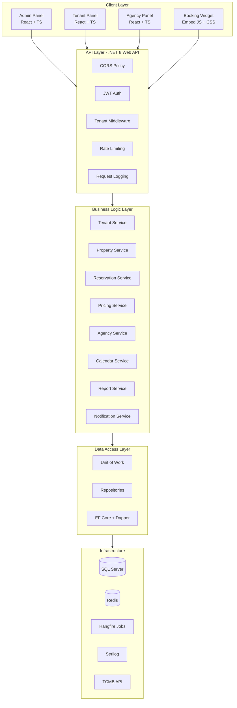

---

## 2. Kullanıcı Rolleri ve Yetkiler

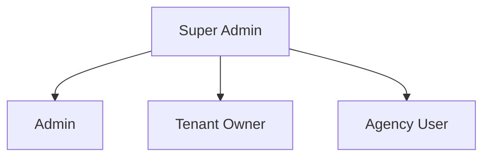

### Yetki Matrisi

| İşlem | Admin | Tenant | Agency |
|---|---|---|---|
| Tenant Yönetimi | ✅ | ❌ | ❌ |
| Mülk Ekleme | ✅ | ✅ | ❌ |
| Mülk Görüntüleme | ✅ | ✅ | ✅* |
| Birim Yönetimi | ✅ | ✅ | ❌ |
| Fiyat Belirleme | ✅ | ✅ | ✅* |
| Rezervasyon Yapma | ✅ | ✅ | ✅* |
| Check-in/out | ✅ | ✅ | ❌ |
| Acente Yetkilendirme | ✅ | ✅ | ❌ |
| Rapor Görüntüleme | ✅ | ✅ | ✅* |
| Sistem Ayarları | ✅ | ❌ | ❌ |
| Abonelik Yönetimi | ✅ | ❌ | ❌ |
| Widget Yönetimi | ✅ | ✅ | ❌ |
| Profil Düzenleme | ✅ | ✅ | ✅ |

* `✅*` işaretli yetkiler, tenant tarafından verilen acente yetkilendirme seviyesine bağlıdır.

---

## 3. Temel İş Akışları

### 3.1 Tenant Kayıt Akışı

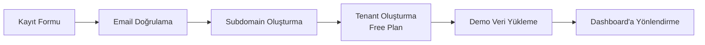

### 3.2 Rezervasyon Oluşturma Akışı

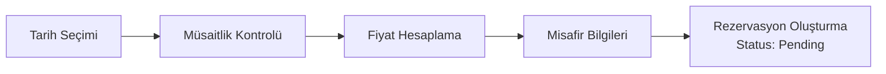

### 3.3 Check-in / Check-out Akışı

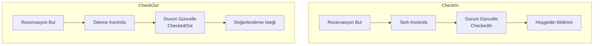

### 3.4 Acente Yetkilendirme Akışı

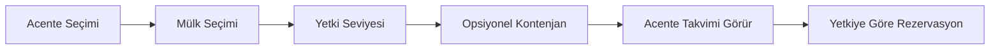

### 3.5 Fiyat Hesaplama Akışı

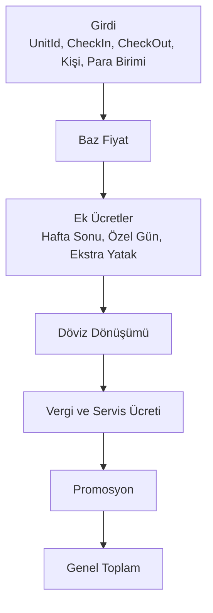

### 3.6 Booking Widget Akışı

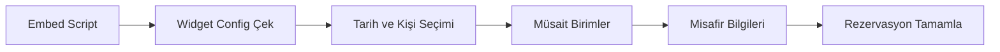

---

## 4. Backend Katman Mimarisi

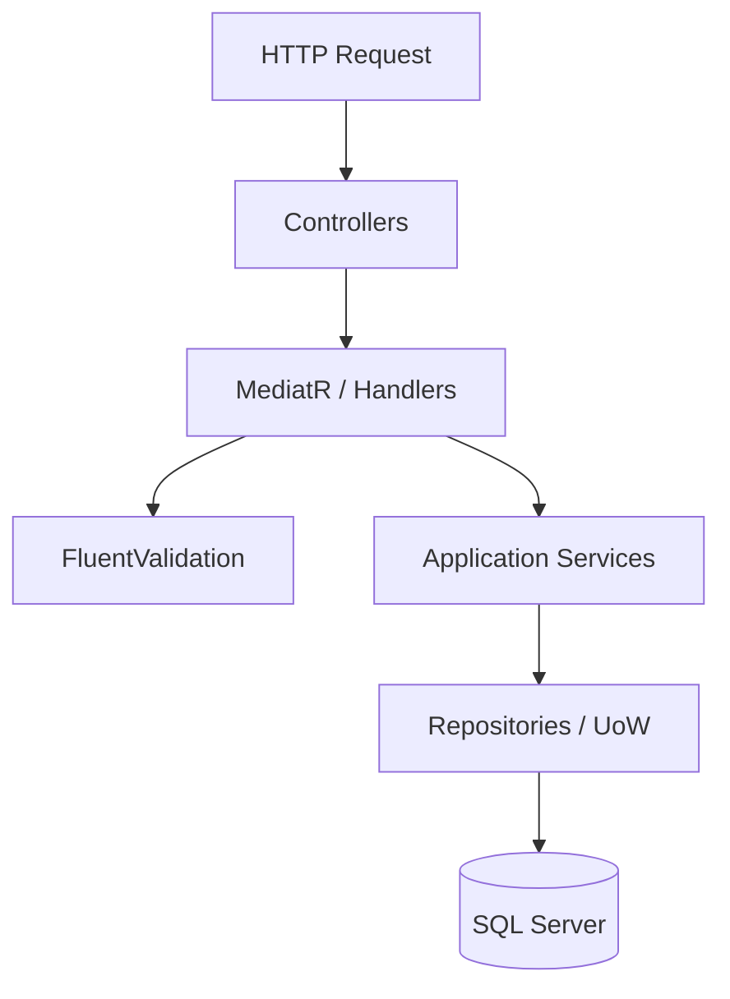

---

## 5. Frontend Bileşen Mimarisi

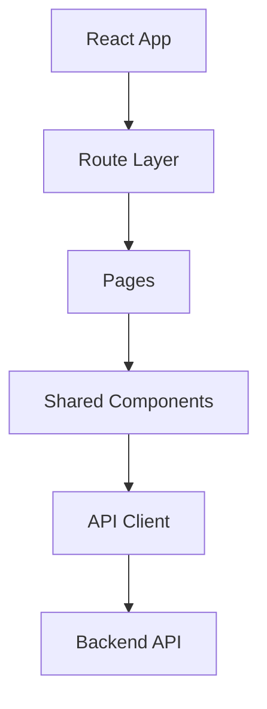

---

## 6. Veritabanı İlişkileri

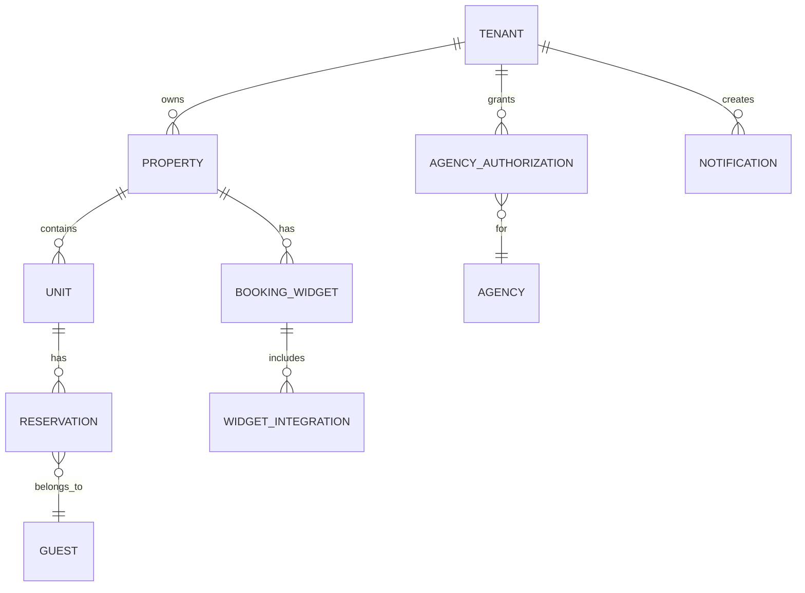

---

## 7. API İletişim Akışı

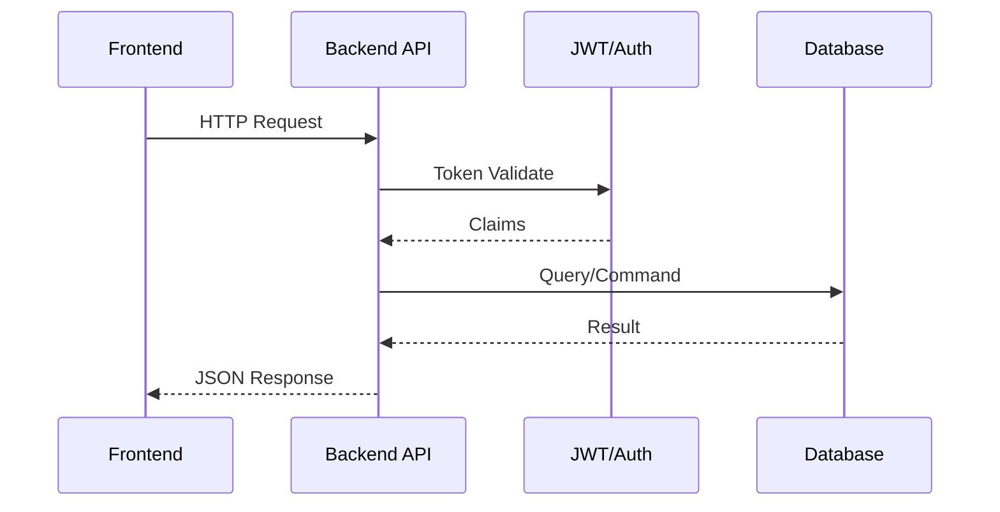

---

## 8. Deployment Mimarisi

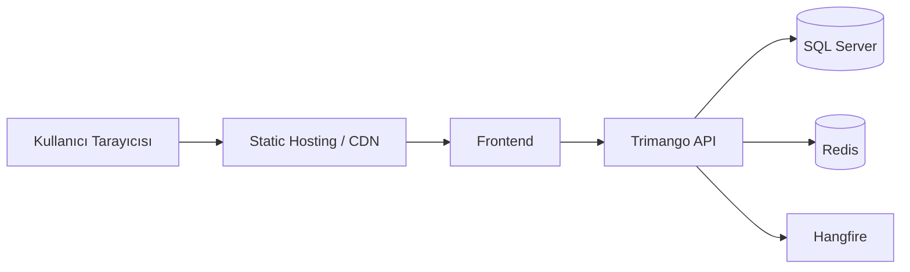
